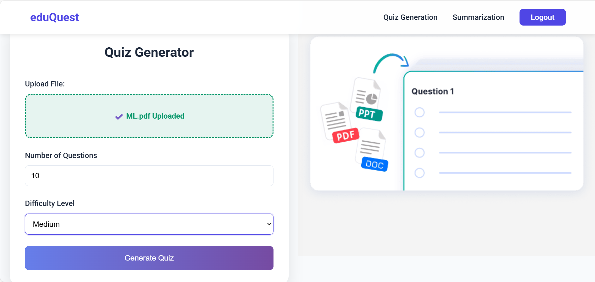
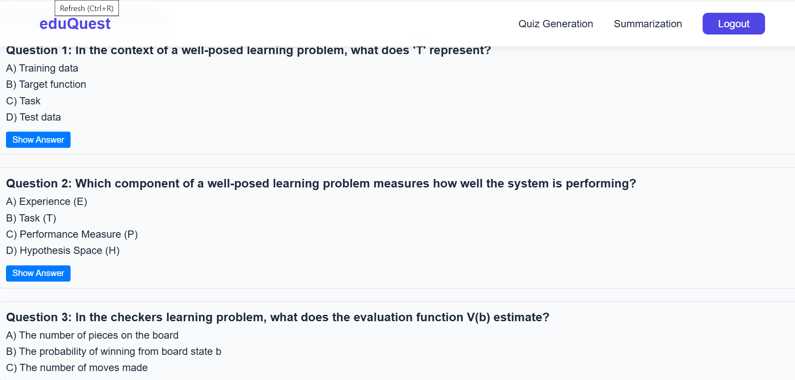
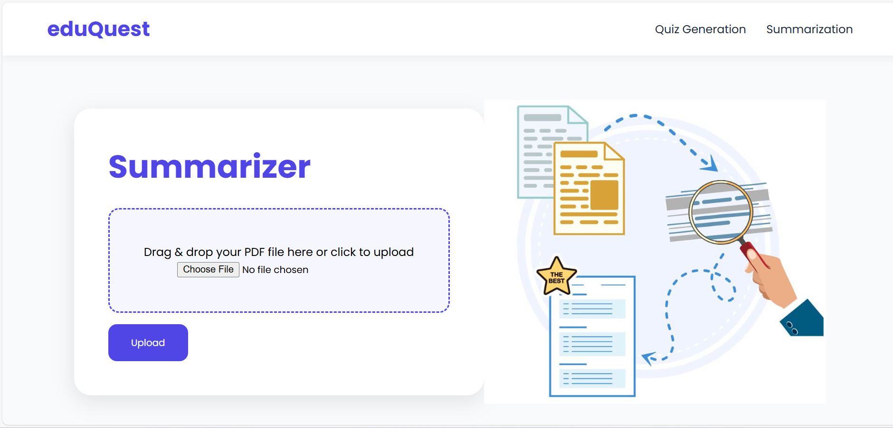
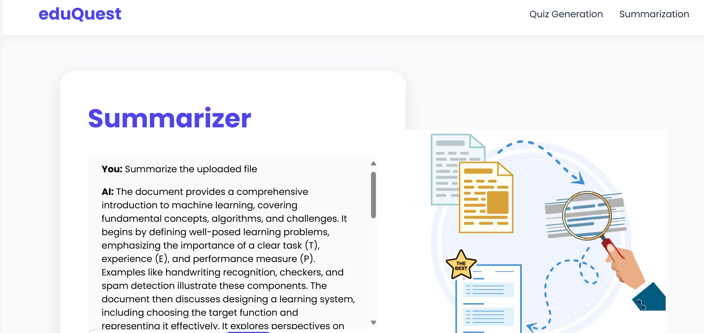

# 🎓 EduQuest

> Transform any document into an interactive learning experience with AI-powered question generation and intelligent summarization.

EduQuest is your smart study companion that turns boring PDFs and documents into engaging multiple-choice quizzes. Whether you're a student preparing for exams or a teacher creating assessments, EduQuest makes learning more interactive and fun!

## ✨ What Makes EduQuest Special?

- **🤖 AI-Powered MCQ Generation**: Upload any document and watch as our AI creates relevant multiple-choice questions automatically
- **📄 Multi-Format Support**: Works with TXT, PDF, and DOCX files - throw anything at it!
- **💾 Export Your Quizzes**: Download generated MCQs as neat TXT files or professional-looking PDFs
- **🔍 Smart PDF Analysis**: Extract text from PDFs and ask questions about the content
- **🔐 Secure & Personal**: User authentication system keeps your documents and quizzes private
- **📧 Password Recovery**: Forgot your password? No worries - email-based reset has got you covered

## 🚀 How It Works

1. **Sign Up**: Create your free account (takes 30 seconds!)
2. **Upload**: Drop your study material - PDF, Word doc, or text file
3. **Generate**: Let our AI (powered by Google Gemini) work its magic
4. **Study**: Review your auto-generated MCQs and ace those exams!
5. **Download**: Save your quizzes for offline studying

## 🛠️ Tech Under the Hood

Built with modern, reliable technology:
- **Django 5** - Rock-solid Python web framework
- **Google Gemini AI** - The brain behind smart question generation
- **PDF Magic** - Advanced text extraction from any PDF
- **Secure Authentication** - Your data stays yours

## 📸 Screenshots

### Home Page


### MCQ Generation



### Summary Generation



## 🏃 Quick Start Guide

### Prerequisites
- Python 3.11 or higher
- A Google account (for Gemini API access)
- Basic command line knowledge

### Installation

1️⃣ **Clone this repo**
```bash
git clone https://github.com/yourusername/eduQuest.git
cd eduQuest
```

2️⃣ **Set up your virtual environment**
```bash
python -m venv myenv
# On Windows:
myenv\Scripts\activate
# On Mac/Linux:
source myenv/bin/activate
```

3️⃣ **Install dependencies**
```bash
pip install -r mcqproject/requirements.txt
```

4️⃣ **Configure your secrets**

Create `mcqproject/.env` with your keys:
```ini
SECRET_KEY=your-super-secret-django-key
DEBUG=True
ALLOWED_HOSTS=localhost,127.0.0.1

EMAIL_HOST_USER=your-email@gmail.com
EMAIL_HOST_PASSWORD=your-gmail-app-password

GOOGLE_API_KEY=your-gemini-api-key
```

> 💡 **Pro Tips:**
> - Generate Django secret key: `python -c "from django.core.management.utils import get_random_secret_key; print(get_random_secret_key())"`
> - Get Gemini API key: Visit [Google AI Studio](https://aistudio.google.com/app/apikey)
> - Gmail app password: Enable 2FA then create at [App Passwords](https://myaccount.google.com/apppasswords)

5️⃣ **Initialize the database**
```bash
python mcqproject/manage.py migrate
```

6️⃣ **Fire it up!**
```bash
python mcqproject/manage.py runserver
```

Visit `http://127.0.0.1:8000/` and start learning! 🎉

## 📁 Project Structure

```
eduQuest/
├── mcqproject/
│   ├── manage.py              # Django's command center
│   ├── requirements.txt       # All the Python packages we need
│   ├── .env                   # Your secret keys (never commit this!)
│   ├── .env.example          # Template for .env file
│   ├── mcqapp/               # The main app (where the magic happens)
│   │   ├── views.py          # Handles all the web requests
│   │   ├── models.py         # Database structure
│   │   ├── templates/        # HTML pages
│   │   └── static/           # CSS, JS, images
│   └── mcqproject/           # Django project settings
│       ├── settings.py       # Main configuration
│       └── urls.py           # URL routing
├── myenv/                    # Virtual environment (auto-generated)
├── .gitignore               # Files Git should ignore
└── README.md                # You are here!
```

## 🤝 Contributing

Found a bug? Have a cool feature idea? Contributions are welcome!

1. Fork the repo
2. Create your feature branch (`git checkout -b new-feature`)
3. Commit your changes (`git commit -m 'Add some new feature'`)
4. Push to the branch (`git push origin new-feature`)
5. Open a Pull Request


